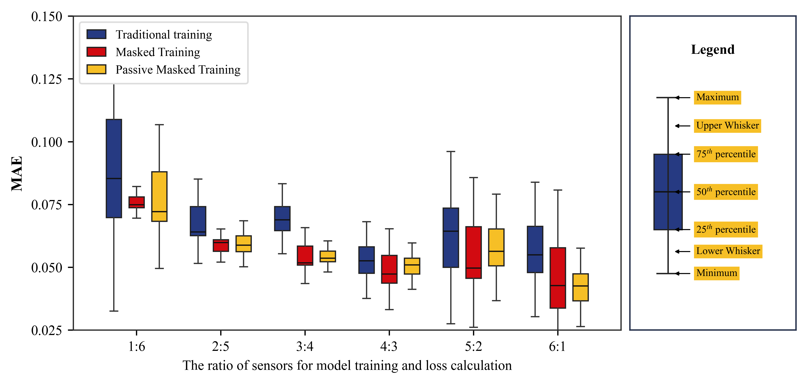
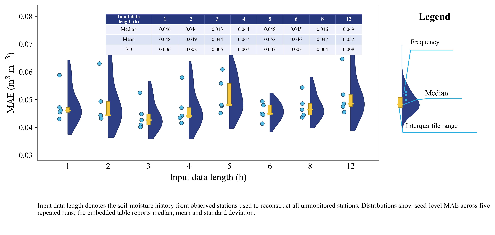
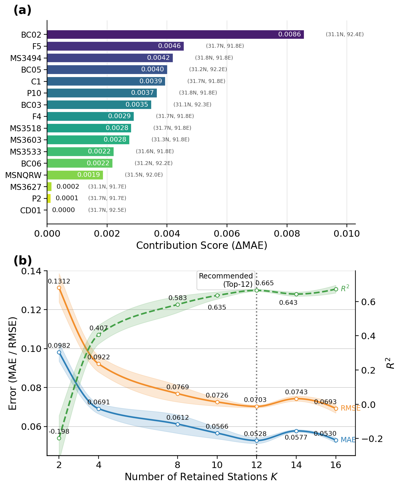
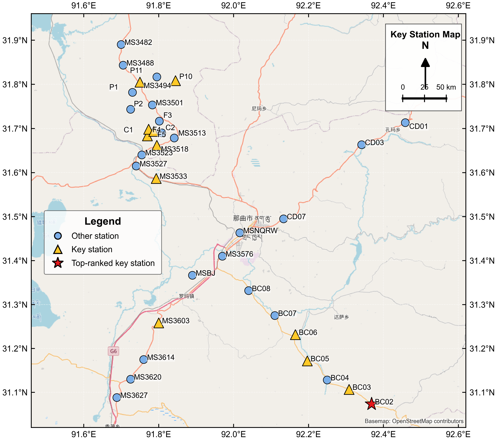

# STGNP 土壤水分论文初稿（参考J Hydrol结构版）

面向稀疏土壤水分监测网络的时空图神经过程：严格站点级留出条件下的未建站点重建

可选英文题目：

Spatio-Temporal Graph Neural Processes for Soil Moisture Reconstruction at Unseen Stations under Sparse Monitoring Networks

---

## 摘要

土壤水分是刻画陆面水文循环、农业干旱监测和生态环境变化的重要变量。然而，受地形条件、传感器部署成本和长期维护难度限制，地面土壤水分监测网络通常具有空间覆盖不足、站点分布不均和观测缺失等问题。如何利用少量已观测站点推断训练阶段未见位置的土壤水分动态，是稀疏监测网络中亟待解决的关键问题。针对这一问题，本文将时空图神经过程（Spatio-Temporal Graph Neural Process, STGNP）引入土壤水分未见站点重建任务，构建了一种面向严格站点级留出场景的土壤水分外推框架。该框架基于站点经纬度构建距离加权空间图，利用时间卷积网络编码近期土壤水分变化，并通过图结构聚合观测站点的时空上下文信息，实现对未监测站点土壤水分序列的重建。

本文以 NAQU 区域 35 个土壤水分站点的 5 cm 深度半小时观测数据为研究对象，采用严格站点级 holdout 协议，保证目标站点在训练阶段完全不参与模型学习。围绕稀疏监测条件下的外推性能，本文系统分析了训练策略、传感器配置比例、输入时间窗口长度、空间邻接保留比例以及关键站点选择对模型性能的影响。实验结果表明，固定站点组合的传统训练策略在未见站点上泛化能力较弱，而随机化站点掩码训练能够显著提升模型对不同观测组合的适应能力。传感器配置实验显示，随着观测站点比例增加，模型误差整体下降，但高观测比例下目标站点数量减少会导致评估方差增大。时间窗口消融结果表明，4 小时输入窗口在多随机种子固定留出实验中取得较稳定的 MAE 表现。关键站点分析进一步表明，仅保留贡献排名前 10 的站点仍能对其余站点保持有效外推能力。上述结果说明，STGNP 不仅可用于稀疏土壤水分监测网络中的未见站点重建，也可为传感器布设优化和关键站点识别提供参考。

关键词：土壤水分；时空图神经过程；未见站点外推；稀疏监测网络；关键站点识别；严格站点级留出

---

## 1. 引言

土壤水分是连接大气、植被和陆地水文过程的重要状态变量，在农业灌溉、干旱监测、生态环境评估和陆面过程模拟中具有基础作用。准确获取区域尺度土壤水分变化，有助于理解水文循环过程、评估植被生长条件并支持农业和生态管理决策。然而，与降雨、气温等气象变量相比，地面土壤水分观测依赖原位传感器，站点建设和维护成本较高，且在高寒、山区或交通条件较差区域更容易受到环境限制。因此，实际土壤水分监测网络通常存在站点数量有限、空间分布不均和观测缺失等问题。

在监测网络稀疏的情况下，仅依赖有限站点难以直接获得完整区域的土壤水分状态。传统空间插值方法，如反距离加权、克里金插值和高斯过程回归，能够根据空间邻近性估计未观测位置的土壤水分，但这类方法通常依赖较强的空间平稳性假设，难以充分刻画土壤水分随时间变化的非线性动态。深度学习方法能够从时间序列中学习复杂变化规律，但多数模型需要目标站点历史观测作为输入，难以自然处理训练阶段完全未见站点的外推问题。图神经网络为建模非欧几里得空间结构提供了有效工具，能够通过节点和边的关系表达站点之间的空间依赖。然而，如果目标站点在训练阶段已经参与图结构或节点表示学习，则模型评价更接近测试节点插值，而不是严格意义上的未见站点外推。

因此，本文关注更加严格且更接近实际部署需求的站点级外推问题：在训练阶段完全移除部分站点，仅利用剩余观测站点及其空间关系学习时空规律，并在推断阶段对从未参与训练的目标站点进行土壤水分重建。该问题不仅要求模型捕捉观测站点的时间动态，还要求模型能够将观测站点中的时空信息迁移到未见位置。

为解决上述问题，本文将时空图神经过程（STGNP）适配到土壤水分未见站点重建任务。STGNP 结合神经过程的上下文—目标建模思想和图结构的信息传播能力，能够在不同观测站点组合下学习从观测站点到目标站点的映射关系。与普通图神经网络不同，STGNP 更适合处理观测集合变化和目标集合变化的场景，因此与稀疏监测网络中的站点重建任务具有较高契合度。

本文主要贡献如下。

第一，构建了面向土壤水分未见站点外推的 STGNP 重建框架。该框架以 NAQU 土壤水分监测网络为研究对象，结合站点坐标、距离加权图结构和半小时土壤水分时间序列，实现严格站点级 holdout 条件下的未见站点预测。

第二，系统分析了训练策略与传感器配置比例对模型性能的影响。通过比较传统固定划分训练、周期性掩码训练和样本级随机掩码训练，本文验证了随机化站点组合对提升模型泛化能力的重要性，并讨论了不同观测:未监测比例下模型误差和稳定性的变化规律。

第三，从训练策略、时间窗口和关键站点选择三个角度进一步分析 STGNP 的时空建模能力。实验结果表明，适当的历史输入长度和空间连接结构对未见站点重建具有重要作用；基于贡献度的 Top-K 站点实验则说明，少量关键站点能够保留较强的区域外推能力，为稀疏监测网络优化提供了可解释依据。

---

## 2. 方法

### 2.1 方法概述

真实土壤水分监测网络通常只能在有限站点布设传感器，未布设站点缺乏连续历史观测。本文的目标是利用少量观测站点的土壤水分序列和站点之间的空间关系，重建训练阶段完全未见站点的土壤水分动态。与普通时间序列预测不同，本文将目标站点视为严格未知站点：这些站点在训练阶段完全从训练数据和训练图结构中移除，仅在推理阶段根据其经纬度被动态加入图结构中。

借鉴稀疏监测水位重建研究中“空间静态数据-时间动态数据-时空模型-训练策略-评价指标”的方法组织方式，本文方法部分分为四个环节。首先，对 NAQU 土壤水分数据进行站点筛选、缺失值标记和时间窗口构建；其次，基于站点经纬度构建距离加权空间图；然后，使用 hierarchical STGNP 对观测站点和目标站点之间的时空依赖进行建模；最后，通过 PMTS3 训练策略增强模型对不同传感器配置的适应能力，并在 strict holdout 站点上评价重建性能。

### 2.2 稀疏土壤水分监测数据预处理

土壤水分监测数据包含两类互补信息：一类是空间静态数据，包括站点编号、经度和纬度；另一类是时间动态数据，包括各站点按 30 min 间隔记录的 5 cm 深度土壤水分序列。本文分别处理这两类数据，并将其组织为适合 STGNP 输入的时空图样本。

#### 2.2.1 站点筛选与缺失值处理

原始 NAQU 站点表包含约 56 个候选站点，但不同站点的观测完整性差异明显。由于本文评价的是未见站点在预测时间段内的重建精度，如果目标站点在测试时间段存在大量缺失值，则可用于评价的真实观测不足，误差统计会变得不稳定；同时，缺失严重的站点也会削弱训练阶段可学习的时间动态。因此，本文首先统计各站点土壤水分序列中 `-99.0` 缺失标记的比例，并按缺失率排序筛选站点。最终保留缺失率低于 20% 的 35 个站点作为主实验网络。该阈值用于在空间覆盖范围和时间序列可用性之间取得平衡，保证 strict holdout 评价阶段仍有足够有效观测用于计算误差。

对于每个保留站点，原始数据中的 `-99.0` 被标记为缺失值，并构建二值缺失掩码：

$$
m_i^t =
\begin{cases}
1, & y_i^t \text{ 为缺失值},\\
0, & y_i^t \text{ 为有效观测值}.
\end{cases}
$$

其中，`m_i^t` 表示站点 `i` 在时刻 `t` 的缺失状态。缺失值不参与归一化统计量计算，也不参与最终评价指标计算。为了形成连续模型输入，缺失位置使用对应站点在当前数据划分中的有效观测均值进行填补；若某站点在该划分内全部缺失，则使用全体有效土壤水分观测的全局均值作为兜底。

归一化采用非缺失观测计算均值和标准差：

$$
\tilde{y}_i^t = \frac{y_i^t - \mu}{\sigma_y}.
$$

其中，`mu` 和 `sigma_y` 分别表示有效土壤水分观测的均值和标准差。训练、验证和测试按时间维度划分，比例分别为 0-70%、80-90% 和 90-100%。

#### 2.2.2 空间静态数据处理

空间静态数据用于描述站点之间的空间依赖关系。设筛选后的监测网络包含 `N` 个站点，每个站点 `v_i` 具有空间坐标：

$$
\mathbf{s}_i = (\mathrm{lon}_i, \mathrm{lat}_i).
$$

本文首先使用 Haversine 公式计算任意两个站点 `v_i` 和 `v_j` 之间的球面距离 `d_ij`，然后使用高斯核函数将距离转换为邻接权重：

$$
A_{ij}=\exp\left[-\frac{1}{2}\left(\frac{d_{ij}}{\sigma_d}\right)^2\right].
$$

其中，`sigma_d` 为所有站点两两距离的标准差。该处理方式使距离较近的站点获得更高连接权重，距离较远的站点保留较弱连接，从而构建连续的距离衰减空间图。

在模型输入中，空间图不是作为完整节点预测图直接使用，而是被切分为从观测站点到目标站点的跨集合邻接矩阵。给定观测站点集合 `C` 和目标站点集合 `T`，一阶邻接矩阵和二阶邻接矩阵分别为：

$$
\mathbf{A}^{(1)}_{T,C}=\mathbf{A}[T,C],
$$

$$
\mathbf{A}^{(2)}_{T,C}=\mathbf{A}^2[T,C].
$$

最终图输入由一阶和二阶跨集合邻接拼接而成，用于同时表达目标站点与观测站点之间的直接空间联系和更宽范围的二阶空间关系。在 strict holdout 推理阶段，目标站点根据经纬度被动态加入数据对象，并使用相同的 Haversine-Gaussian 规则重新计算其与观测站点之间的空间连接。这样，模型可以利用目标站点的位置计算空间关系，但不会在训练阶段接触其土壤水分历史。

#### 2.2.3 时间动态数据处理

时间动态数据用于描述各站点土壤水分随时间的变化过程。对于站点 `v_i`，其土壤水分序列表示为：

$$
\mathbf{y}_i = \{y_i^1, y_i^2, \ldots, y_i^T\}.
$$

其中，`T` 为时间步数，采样间隔为 30 min。经过缺失值填补和归一化后，各站点的土壤水分序列被组织为节点属性矩阵：

$$
\mathbf{Y} \in \mathbb{R}^{N \times T \times 1}.
$$

其中，第一维表示站点，第二维表示时间，第三维表示土壤水分变量。当前模型仅使用土壤水分作为动态输入变量，因此通道数为 1；若后续加入降雨、气温、地表温度或植被指数等环境因子，可在第三维继续扩展。

为了构建模型样本，本文采用滑动时间窗口聚合时间动态数据。设历史输入窗口长度为 `L`，则站点 `v_i` 在样本时刻 `t` 的输入序列为：

$$
\mathbf{Y}_{i,t-L+1:t} = \{\tilde{y}_i^{t-L+1}, \ldots, \tilde{y}_i^t\}.
$$

由于数据采样间隔为 30 min，当历史输入长度为 `h` 小时时，窗口长度为 `L = 2h`。主实验采用 4 h 历史窗口，因此 `L = 8`。训练阶段，DataLoader 在时间维度上抽取窗口样本；验证和测试阶段，可按固定步长滑动窗口进行连续评估。每个样本最终包含观测站点的历史土壤水分窗口、目标站点的监督值、对应的缺失掩码，以及从观测站点到目标站点的一阶和二阶空间邻接矩阵。

### 2.3 Hierarchical STGNP 模型构建

本文采用 hierarchical STGNP 作为土壤水分未见站点重建模型。该模型结合神经过程的 context-target 条件建模思想和图神经网络的空间信息传播能力，能够处理观测站点数量和目标站点组合动态变化的稀疏监测场景。给定观测站点集合 `C` 和目标站点集合 `T`，模型学习如下条件分布：

$$
p(\mathbf{Y}_{T} \mid \mathbf{Y}_{C}, \mathbf{A}).
$$

其中，`Y_C` 表示观测站点的历史土壤水分窗口，`Y_T` 表示目标站点待重建的土壤水分序列，`A` 表示空间邻接关系。模型主要由时空图编码模块、随机潜变量推断模块和观测解码模块组成。

#### 2.3.1 时空图编码模块

时空图编码模块对应 hierarchical STGNP 的确定性路径，用于从观测站点中提取可迁移到目标站点的时空上下文信息。首先，模型使用一维卷积将土壤水分输入映射到嵌入空间。对于观测站点，输入为其历史土壤水分窗口；对于推理阶段的目标站点，由于其观测值不可用，模型使用可学习的空 token 作为初始目标表示。

随后，模型基于一阶和二阶跨集合邻接矩阵执行从观测站点到目标站点的图聚合。聚合时，缺失掩码用于屏蔽无效的观测站点时间记录，避免填充值对空间信息传播产生直接贡献。该过程可概括为：目标站点先接收来自观测站点的空间加权表示，再与自身目标表示拼接，并经过可学习非线性映射得到新的目标表示。

完成空间聚合后，模型使用因果时间卷积提取历史窗口内的短期土壤水分动态。不同层采用递增膨胀率的时间卷积，使模型能够在有限窗口内捕捉不同尺度的时间依赖；残差连接用于稳定层间特征传播。由此得到的目标站点表示同时包含观测站点的空间上下文和近期土壤水分变化信息。

#### 2.3.2 随机潜变量推断模块

随机潜变量推断模块用于描述未见站点重建中的不确定性。模型分别构建由观测站点信息诱导的条件先验分布，以及训练阶段由观测站点和目标站点共同估计的后验分布：

$$
p(\mathbf{z}_{T} \mid \mathbf{Y}_{C},\mathbf{A}),
$$

$$
q(\mathbf{z}_{T} \mid \mathbf{Y}_{C},\mathbf{Y}_{T},\mathbf{A}).
$$

先验和后验均被建模为高斯分布，其均值和方差由神经网络输出。模型通过空间权重和缺失掩码对观测站点潜变量信息进行贝叶斯式聚合。训练阶段使用重参数化采样优化潜变量表示；推理阶段没有目标站点观测值，因此使用条件先验均值生成预测。

#### 2.3.3 观测解码模块

观测解码模块将目标站点潜变量表示映射为土壤水分预测分布：

$$
p(\hat{\mathbf{Y}}_{T}\mid \mathbf{z}_{T}) = \mathcal{N}(\boldsymbol{\mu}_{T}, \boldsymbol{\sigma}_{T}).
$$

其中，`mu_T` 为预测均值，`sigma_T` 表示预测不确定性。本文在误差评价和结果分析中使用预测均值作为重建土壤水分值。当前实验采用 `SM_config1` 配置：TCN 通道数为 `[32, 64]`，潜变量通道数为 `[16, 32]`，输入嵌入维度为 16，潜变量层数为 1，观测网络为三层卷积式 MLP，隐藏维度为 128，时间卷积核大小为 3，dropout 为 0.1。

### 2.4 PMTS3 训练策略

在 strict holdout 场景中，模型不仅需要学习时间动态，还需要适应不同观测站点组合下的空间信息传递。为分析训练站点组合方式对泛化能力的影响，本文比较三类训练策略：TTS、MTS/orig 和 PMTS。

TTS 在训练开始前固定一组 context 站点和 target 站点，并在整个训练过程中保持不变。该策略用于检验固定传感器配置是否会限制模型对未见站点组合的泛化能力。MTS/orig 在每个训练样本中随机抽取若干训练站点作为 target，其余训练站点作为 context，能够在样本级增加站点组合多样性。PMTS 则在训练过程中按固定周期重采样 context-target 划分，并在一个周期内保持该划分不变。

本文后续主实验采用 PMTS3，即每 3 个 epoch 重新采样一次训练 target/context 组合。与 TTS 相比，PMTS3 增加了训练期间接触到的传感器配置；与逐样本随机掩码相比，它在短周期内保留了固定配置的训练稳定性。因此，PMTS3 被用作后续实验的统一训练策略。

传感器配置实验中，本文设置观测:未监测站点比例为 1:6、2:5、3:4、4:3、5:2 和 6:1。对于 35 站点网络，这些比例分别对应 5、10、15、20、25 和 30 个观测站点。训练策略与传感器配置实验用于确定后续主实验设置：PMTS3 + 6:1 作为性能导向主配置，4:3 作为成本-精度折中配置；关键站点实验则进一步分析更低成本条件下是否存在最小合格监测骨架。

### 2.5 优化目标与评价指标

模型训练目标由目标站点有效观测上的负对数似然和潜变量后验-先验之间的 KL 散度组成：

$$
\mathcal{L}
= -\log p(\mathbf{Y}_{T}\mid \mathbf{z}_{T})
+ \beta \sum_l D_{\mathrm{KL}}\left(q_l(\mathbf{z}_{T})\Vert p_l(\mathbf{z}_{T})\right).
$$

其中，`l` 表示潜变量层，`beta` 控制 KL 项权重。训练时使用目标站点缺失掩码过滤无效观测，避免缺失填充值进入似然项。验证阶段以 RMSE 选择最佳模型。

重建性能仅在 strict holdout 目标站点的非缺失记录上计算。本文主要报告 MAE、RMSE 和 R2。设 `Omega` 为有效评价样本集合，`y_i` 为真实土壤水分值，`yhat_i` 为模型重建值，则：

$$
\mathrm{MAE}=\frac{1}{|\Omega|}\sum_{i\in\Omega}|\hat{y}_i-y_i|,
$$

$$
\mathrm{RMSE}=\sqrt{\frac{1}{|\Omega|}\sum_{i\in\Omega}(\hat{y}_i-y_i)^2},
$$

$$
R^2=1-\frac{\sum_{i\in\Omega}(y_i-\hat{y}_i)^2}
{\sum_{i\in\Omega}(y_i-\bar{y})^2}.
$$

MAE 是本文的主要评价指标，用于衡量平均重建偏差；RMSE 对局部较大误差更敏感；R2 反映模型对未见站点土壤水分变化的解释能力。在空间误差分布和代表站点分析中，本文还报告站点级 MAE、RMSE、R2 和 MAPE。由于土壤水分真实值接近零时 MAPE 可能不稳定，MAPE 仅作为辅助指标，并与 MAE 和 RMSE 共同解释。

## 3. 案例研究

### 3.1 研究区域与数据集

本文以青藏高原中部那曲（NAQU）土壤水分监测网络为案例研究对象。该网络位于西藏自治区那曲地区，是青藏高原土壤水分遥感验证和陆面过程研究中常用的地面观测网络之一。研究区海拔高、地表以高寒草地为主，站点建设和长期维护成本较高，因而具有稀疏监测网络的典型特征。本文使用的站点经度范围为 91.69-92.46°E，纬度范围为 31.07-31.89°N，海拔范围为 4470-4953 m。站点在空间上覆盖了若干局部簇和边缘位置，能够为未见站点重建任务提供具有空间差异性的案例场景。

原始数据来自国家青藏高原科学数据中心发布的青藏高原中部土壤温湿度观测数据（https://data.tpdc.ac.cn/zh-hans/data/805a6b93-201c-48ea-a131-27dd639d477a）。数据包含站点位置表和土壤水分时间序列表两部分。站点位置表记录站点编号、经度、纬度和海拔；时间序列表按统一时间戳记录各站点的土壤水分观测值。本文选取 5 cm 深度土壤水分作为研究变量，时间分辨率为 30 min，原始缺失值以 `-99.0` 标记。

由于不同站点的长期观测完整性存在差异，本文从原始 NAQU 候选站点中筛选缺失率低于 20% 的站点，得到 35 个站点作为主实验数据集。筛选后的数据时间范围为 2010 年 8 月 1 日至 2021 年 10 月 1 日，共 195793 个 30 min 时间步；整体缺失率约为 8.73%，有效土壤水分观测值范围为 0.000-0.793。该筛选后的站点集合记为 NAQU selected35，后续所有实验均在该数据集上进行。

表 1. NAQU selected35 土壤水分数据集统计信息。

| 项目 | 内容 |
|---|---|
| 数据来源 | 国家青藏高原科学数据中心 |
| 研究区域 | 青藏高原中部那曲（NAQU）地区 |
| 站点数量 | 35 |
| 观测变量 | 5 cm 土壤水分 |
| 时间分辨率 | 30 min |
| 时间范围 | 2010-08-01 至 2021-10-01 |
| 经纬度范围 | 91.69-92.46°E, 31.07-31.89°N |
| 海拔范围 | 4470-4953 m |
| 缺失标记 | `-99.0` |
| 整体缺失率 | 约 8.73% |

在模型输入中，NAQU selected35 被组织为两类数据。空间静态数据由站点经纬度构成，用于生成 35 × 35 的距离加权邻接矩阵；时间动态数据由 35 个站点的土壤水分序列构成，可记为 $\mathbf{Y} \in \mathbb{R}^{35 \times 195793 \times 1}$。这种组织方式与参考论文中“空间静态数据和时间动态数据”的案例研究写法一致：先明确网络对象和数据维度，再说明其如何进入时空图模型。

### 3.2 STGNP 模型应用与参数设置

在本案例研究中，每个土壤水分站点被视为图中的一个节点，站点间边权由经纬度距离转换得到。对于 35 个筛选站点，完整空间图的邻接矩阵可记为 $\mathbf{A} \in \mathbb{R}^{35 \times 35}$。在训练和测试过程中，模型并不直接进行全节点同步预测，而是根据当前观测站点集合和目标站点集合，从完整邻接矩阵中提取跨集合一阶和二阶邻接矩阵，作为 STGNP 的空间输入。

时间动态输入采用滑动窗口构建。给定历史窗口长度 `L`，模型使用观测站点最近 `L` 个时间步的土壤水分序列重建目标站点当前土壤水分值。由于数据采样间隔为 30 min，`L = 8` 对应 4 h 历史窗口，`L = 6` 对应 3 h 历史窗口。第 4.1 节训练策略与传感器配置实验沿用 4 h 窗口，以保持与早期实验设置一致；第 4.2 节进一步比较不同输入窗口长度，并据此确定后续主设置。

本文采用 hierarchical STGNP 作为主模型，具体模型配置为 `SM_config1`。该配置的主要参数见表 2。训练过程使用 Adam 优化器，初始学习率为 0.001，batch size 为 128，KL 项权重 `beta` 为 1.0。模型训练 30 个 epoch，不使用额外学习率衰减；验证阶段以 RMSE 选择最佳 checkpoint。除特别说明外，每组实验在多个随机种子上重复运行，并报告 MAE、RMSE 和 R2 的均值与标准差。

表 2. Hierarchical STGNP 的主要模型与训练参数。

| 参数 | 设置 |
|---|---|
| 模型 | hierarchical STGNP |
| 配置名称 | `SM_config1` |
| 输入变量数 | 1（土壤水分） |
| TCN 通道数 | `[32, 64]` |
| 潜变量通道数 | `[16, 32]` |
| 嵌入维度 | 16 |
| 潜变量层数 | 1 |
| 观测网络隐藏维度 | 128 |
| 观测网络层数 | 3 |
| 时间卷积核大小 | 3 |
| Dropout | 0.1 |
| 优化器 | Adam |
| 初始学习率 | 0.001 |
| Batch size | 128 |
| 训练轮数 | 30 |
| 验证选择指标 | RMSE |

基于上述数据组织和参数设置，第 4 章进一步分析训练策略、传感器配置比例、时间窗口长度以及关键站点选择对模型性能的影响。由此，案例研究部分主要交代数据集、图结构输入和模型应用设置，结果部分则集中讨论不同实验因素对未见站点重建精度的影响。

---

## 4. 结果与讨论

### 4.1 训练策略与传感器配置比例的影响

为评估模型从已监测站点向严格未见站点外推的学习能力，我们首先研究训练策略与传感器配置的联合影响。该实验有两个目的：其一，确定严格站点级留出重建的合适训练协议；其二，给出重建精度随监测站点数量变化的参考，为后续关键站点子集实验提供动机。

我们比较了三种训练策略。第一种是 TTS，在整个训练过程中固定上下文—目标站点划分。第二种是 MTS，对每个训练样本进行多目标采样：从可用训练站点中随机选择 `num_train_target = 3` 个目标站点，其余站点作为上下文站点。该策略在样本级暴露多样的目标—上下文组合。第三种是 PMTS，周期性重采样训练目标—上下文划分；本实验中重采样频率为每 3 个 epoch。与 MTS 相比，PMTS 在短时间段内保持配置不变，并周期性刷新，从而更接近不同传感器部署配置的序列。

所有策略均在相同的严格留出协议下评估：留出站点在训练子集中被完全移除，仅在推理阶段动态加入图结构。考虑六种监测:未监测比例：1:6、2:5、3:4、4:3、5:2、6:1。对 NAQU 选取的 35 个站点而言，对应 5、10、15、20、25、30 个监测站点。所有实验使用 hierarchical STGNP 与 `SM_config1`。每个训练策略与比例组合在 5 个随机种子上重复，性能仅在严格留出的站点上评估，指标为 MAE、RMSE、R2，以 MAE 为主。

图 5. 训练策略与传感器配置比例对 strict holdout 未见站点重建 MAE 的影响。横轴为观测:未监测站点比例，纵轴为 holdout 站点非缺失记录上的 MAE；点和误差范围表示 5 个随机种子的均值与波动。

如图 5 所示，固定的 TTS 普遍劣于两种随机配置策略。在最稀疏的 1:6 设置下，TTS 的 MAE 为 0.0894 +/- 0.0290，R2 仅为 0.0268 +/- 0.5911，表明固定目标配置下外推极不稳定。相比之下，MTS 将 MAE 降至 0.0759 +/- 0.0032，PMTS3 在同一比例下达到 0.0782 +/- 0.0146。尽管 TTS 在监测站点增多时有所改善，但整体性能仍较弱且在稀疏设置下更不稳定。这说明单一固定的上下文—目标划分无法提供足够的空间配置多样性，难以支撑严格未知站点重建。

MTS 与 PMTS3 均受益于随机站点配置，但优势出现在不同传感器比例下。MTS 在中等比例下表现突出。在 4:3 比例时，MTS 的 MAE 为 0.0492 +/- 0.0082，RMSE 为 0.0643 +/- 0.0097，R2 为 0.7023 +/- 0.0603，略优于同一比例下的 PMTS3（MAE 0.0505 +/- 0.0047，RMSE 0.0666 +/- 0.0061，R2 0.6880 +/- 0.0335）。这表明在监测站点数量适中时，样本级目标重采样已足够有效，模型能见到充分多样的目标—上下文组合。

然而，在最密集的观测设置下，PMTS3 取得了最佳总体表现。在 6:1 比例下，MTS 的 MAE 为 0.0458 +/- 0.0178，RMSE 为 0.0583 +/- 0.0201，R2 为 0.7085 +/- 0.1698。PMTS3 进一步将 MAE 降至 0.0420 +/- 0.0080，RMSE 降至 0.0546 +/- 0.0103，R2 提升至 0.7925 +/- 0.0219。相比 MTS，PMTS3 在 6:1 下不仅均值更低，R2 的波动也显著更小，表明在较大监测站点集合下，周期性保持固定配置再重采样能提供更稳定的学习信号。

传感器配置对重建精度也有明显影响。MTS 的 MAE 从 1:6 的 0.0759 +/- 0.0032 降至 4:3 的 0.0492 +/- 0.0082，显示随着监测站点从 5 增至 20，性能显著提升。PMTS3 的 MAE 从 1:6 的 0.0782 +/- 0.0146 降至 4:3 的 0.0505 +/- 0.0047，并在 6:1 进一步降至 0.0420 +/- 0.0080。这表明 4:3 是一个稳定的低误差区间且监测成本适中，而 6:1 则是性能导向的最佳配置，因为监测站点最多，仅有 5 个严格留出目标站点。

基于上述结果，后续主实验中剔除 TTS。MTS 作为重要的随机采样基线保留，尤其是在 4:3 比例下具有竞争力。但 PMTS3 被选为默认训练策略，因为其在性能导向的 6:1 配置下取得最佳结果，并具备更清晰的传感器配置解释。具体而言，PMTS3 在短时间内维持固定监测—目标配置，并每三轮刷新一次，在配置稳定性与空间组合多样性之间取得平衡。

该实验也明确了后续分析中的传感器比例角色：6:1 作为主配置用于性能导向实验，因为 PMTS3 在该比例下 MAE 最低且 R2 最高；4:3 则作为成本—精度折中参考，因为 MTS 与 PMTS3 均在该比例下取得约 0.05 的稳定 MAE。由此引出后续关键站点实验：不仅增加监测站点数量，还进一步探索是否可用更紧凑、信息量更高的站点子集在更稀疏部署下保持大部分重建能力。

### 4.2 输入时间窗口长度对模型性能的影响

本节评估观测站点历史输入长度对 STGNP 未见站点重建精度的影响。土壤水分状态具有明显的时间连续性，历史观测能够为当前状态重建提供动态背景；但历史窗口过长也可能引入与当前状态弱相关的冗余信息，从而增加模型提取关键特征的难度。因此，在确定 PMTS 作为主训练框架后，本文进一步比较不同历史输入长度下模型的重建性能。

实验采用 PMTS 训练策略和 6:1 传感器配置，即 30 个观测站点用于重建 5 个未监测站点。本文设置 1、2、3、4、5、6、8 和 12 h 共 8 种输入数据长度。由于 NAQU 土壤水分数据的采样间隔为 30 min，上述窗口分别对应 2、4、6、8、10、12、16 和 24 个时间步。每个窗口长度在 5 个随机种子上重复训练与测试，并在 strict holdout 站点的非缺失观测上计算 MAE、RMSE 和 R2。结果如图 7 所示。

图 7. 输入历史窗口长度对未见站点重建 MAE 的影响。输入数据长度表示用于重建未监测站点的观测站点土壤水分历史窗口。

随着输入数据长度增加，模型重建误差呈现先下降后上升的非线性变化，而不是随历史信息增加而单调改善。3 h 输入窗口取得最低平均 MAE，为 0.0442 +/- 0.0044，同时对应最低 RMSE（0.0555 +/- 0.0036）和最高 R2（0.8189 +/- 0.0245）。这表明，在当前 NAQU 35 站点网络和 PMTS 训练框架下，3 h 左右的近期历史信息能够较好地刻画土壤水分短期变化，并为未见站点重建提供最有效的时间上下文。

当输入窗口较短时，历史信息不足限制了模型对土壤水分变化趋势的识别。1 h 和 2 h 窗口的平均 MAE 分别为 0.0481 +/- 0.0055 和 0.0488 +/- 0.0074，均高于 3 h 窗口。该结果说明，仅利用最近 0.5-1 h 的观测序列难以充分表征站点间可迁移的短期动态，尤其在目标站点完全未参与训练的 strict holdout 场景下，模型需要一定长度的历史信息来稳定推断未监测位置的当前状态。

然而，继续增加历史输入长度并未进一步提高重建精度。5 h 和 12 h 窗口的平均 MAE 分别升高至 0.0515 +/- 0.0059 和 0.0516 +/- 0.0068，是本组实验中表现较弱的两个设置；8 h 窗口的 MAE 为 0.0475 +/- 0.0038，也未优于 3 h。该现象表明，较远历史记录对当前土壤水分重建的边际贡献有限，过长输入反而可能增加冗余信息，使模型更难聚焦于近期有效动态。

从结果稳定性看，6 h 窗口的平均 MAE 为 0.0456 +/- 0.0028，虽然略高于 3 h，但标准差最低，说明其跨随机种子的波动较小。因此，3 h 可作为后续性能导向实验的默认输入长度，6 h 可作为稳定性较强的备选设置。相比之下，4 h 窗口在早期固定 holdout 消融中曾表现较稳，但在 PMTS + 6:1 的统一复验下，其 MAE 为 0.0468 +/- 0.0058，已不再是最优窗口。

综上，历史输入长度是影响 STGNP 未见站点重建性能的重要因素，但更多历史信息并不必然带来更高精度。当前实验表明，适中的 3 h 输入窗口能够在动态信息利用和冗余控制之间取得较好平衡，因此被选为后续 PMTS 主实验的默认时间窗口。

### 4.3 未见站点重建精度的空间分布

为了进一步分析模型在不同站点上的重建效果，本文对测试阶段各未见站点的预测误差进行空间可视化。具体而言，将站点级 MAE、RMSE 或 MAPE 映射到站点空间位置上，并通过颜色或气泡大小表示误差水平。该图能够直观展示模型在不同空间区域的重建能力差异。

空间分布结果可用于回答两个问题：一是模型误差是否集中在特定区域，二是误差较大的站点是否与空间孤立、邻近观测站点不足或土壤水分变化剧烈有关。如果高误差站点主要分布在观测站点稀疏区域，则说明空间覆盖度对 STGNP 外推能力具有重要影响；如果某些站点即使邻近观测站点仍误差较高，则可能说明该站点具有特殊局地环境或时间动态特征。

【待补结果】建议在本节补充“站点预测精度空间分布图”，并按照误差等级划分站点，例如 MAE ≤ 0.04、0.04 < MAE ≤ 0.06、0.06 < MAE ≤ 0.08、MAE > 0.08。论文表述应重点解释空间误差分布与观测站点覆盖之间的关系，而不仅是展示图像。

### 4.4 关键站点贡献与 Top-K 重建实验

为了进一步从监测网络角度解释 STGNP 的外推能力，本文设计了关键站点贡献与 Top-K 重建实验。该实验不再只关注模型在某一固定划分下的预测误差，而是回答两个更接近传感器布设的问题：哪些站点为其他未监测站点提供了更强的可迁移信息，以及在只保留少量关键站点时，模型还能否维持可接受的区域重建能力。

关键站点贡献度通过大量随机站点去除实验中的“移除—保留”对比实现。具体而言，本文在不同随机种子和不同站点留出组合下累计进行了 80 次严格站点级去除实验，使每个候选站点在多种空间上下文中分别出现为“被移除目标站点”和“被保留观测站点”。在此基础上，针对每一个候选站点 $i$，分别统计 $i$ 被移除为目标站点时和 $i$ 被保留为观测站点时，模型在其他目标站点上的平均误差表现。这里的关键处理是排除 self-error：对于每一次实验，不直接使用所有目标站点的平均误差，而是先从目标站点误差集合中剔除候选站点 $i$ 本身，再计算剩余目标站点的平均误差，记为 $M_{-i}$。也就是说，如果某站点 $i$ 本身很难预测、但它被移除后并没有让其他站点变得更难预测，那么该站点的高自身误差不会被计入贡献分数。贡献度只衡量“有无该站点作为观测上下文”对其他站点重建的影响，而不是衡量该站点自身是否容易被重建。

设第 $r$ 次随机去除实验中的目标站点集合为 $H_r$，站点 $j$ 的预测误差为 $e_{r,j}$。对于候选站点 $i$，排除自身误差后的其他目标站点平均误差定义为：

$$
M_{-i}^{(r)}=\frac{1}{N_{r,i}}\sum_{j\in H_r,\ j\ne i} e_{r,j},
$$

其中 $N_{r,i}$ 表示第 $r$ 次实验中除候选站点 $i$ 以外的目标站点数量。进一步将包含 $i$ 的去除实验集合记为 $R_i^-$，即 $i$ 被移除为目标站点；将不包含 $i$ 的实验集合记为 $R_i^+$，即 $i$ 被保留在观测站点中。对于 MAE 指标，站点 $i$ 的贡献分数定义为：

$$
\Delta_i^{\mathrm{MAE}}=\frac{1}{|R_i^-|}\sum_{r\in R_i^-}M_{-i}^{(r)}-\frac{1}{|R_i^+|}\sum_{r\in R_i^+}M_{-i}^{(r)}.
$$

该公式表示：若移除 $i$ 后，其他目标站点的平均 MAE 高于保留 $i$ 时的平均 MAE，则 $\Delta_i^{\mathrm{MAE}}$ 为正且数值越大，说明 $i$ 对其他站点重建的贡献越强。

RMSE 的贡献分数采用与 MAE 相同的误差差值方向；对于 $R^2$ 这类越大越好的指标，则采用相反方向的差值进行辅助判断。本文以 MAE 差值作为主要贡献分数，并结合 RMSE 与 $R^2$ 变化评估站点贡献的稳健性。

贡献排序结果表明，BC02 是当前网络中最关键的站点，其贡献分数达到 0.0086，明显高于其他站点（图 8a）。随后依次为 F5、MS3494、BC05、C1、P10、BC03、F4、MS3518 和 MS3603，这些站点构成了贡献排名前 10 的核心观测集合。扩展到 Top-16 时，MS3533、BC06、MSNQRW、MS3627、P2 和 CD01 也被纳入候选关键站点集合，但后几个站点的贡献分数已经接近 0，说明其对其他站点重建的边际增益较弱。该结果表明，站点贡献并不随站点数量均匀增加，而是呈现明显的头部集中现象：少数站点承担了主要的空间信息支撑作用。

在贡献排序基础上，本文进一步开展 Top-K 重建实验。实验按照贡献分数从高到低依次选取前 K 个站点作为可用观测站点，并将其余站点全部视为未监测目标站点；随后在相同输入窗口和评价协议下重新训练并评估 STGNP。本文比较了 K = 2、4、8、10、12、14 和 16 七种稀疏部署情景，每种设置重复 3 次，以评估关键站点数量增加对重建性能的影响。

Top-K 结果显示，当仅保留 2 个站点时，模型难以获得足够空间上下文，平均 MAE 为 0.0982，RMSE 为 0.1312，R2 为 -0.198（图 8b）。当 K 增加到 4 时，MAE 下降到 0.0691，R2 提升到 0.407，说明少量高贡献站点已经能够显著改善区域外推。继续增加关键站点数量后，模型性能总体继续提升：K = 8 时 MAE 为 0.0612，K = 10 时进一步下降到 0.0566，K = 12 时达到最低 MAE（0.0528）和较低 RMSE（0.0703），同时 R2 提升到 0.665。该结果说明，在 35 站点网络中，约 12 个高贡献站点已经能够保留大部分对区域土壤水分重建有用的空间上下文。

进一步增加到 K = 14 并未带来稳定收益，MAE 反而升高到 0.0577；K = 16 时 MAE 回落到 0.0530，RMSE 降至 0.0693，R2 达到 0.673，但相较 K = 12 的 MAE 改善并不明显。因此，从误差和部署成本的综合角度看，Top-12 是当前实验中更具性价比的关键站点配置，而 Top-16 更接近在增加冗余观测后的稳定性上限。该现象也说明，监测网络优化不能简单等同于增加站点数量；站点是否位于能够支撑区域外推的信息位置，比单纯的数量扩张更关键。

图 8. 关键站点贡献排序与 Top-K 重建性能。a，基于移除—保留对比得到的 Top-16 站点贡献排序，贡献分数表示该站点对其他未见站点重建 MAE 的边际影响。b，仅保留贡献排名前 K 个站点作为观测站点时的重建性能，阴影表示 3 次重复实验的标准差。

由于 Top-K 重建实验显示 Top-12 在误差水平和部署规模之间取得较好平衡，本文进一步将贡献排名前 12 的站点映射到空间位置上，以分析关键站点的地理分布特征（图 9）。Top-12 关键站点包括 BC02、F5、MS3494、BC05、C1、P10、BC03、F4、MS3518、MS3603、MS3533 和 BC06，其中贡献最高的 BC02 位于研究区东南部，其余关键站点主要分布在东南部 BC 站点带、西北部密集站点群以及中南部过渡区域。该分布说明，关键站点并非简单集中在一个局部簇内，而是在不同空间子区域中提供互补的观测锚点：东南部 BC02、BC03、BC05 和 BC06 对低纬度站点带具有较强约束作用，西北部 F4、F5、C1、P10、MS3494 和 MS3518 等站点覆盖了站点密集且土壤水分动态差异较大的区域，MS3603 和 MS3533 则补充了中南部空间连接。因而，Top-12 配置能够在较少站点数量下保留相对完整的空间覆盖，这与其在重建实验中取得较低 MAE 的结果相一致。

图 9. Top-12 关键站点空间分布。黄色三角形表示根据贡献排序和 Top-K 重建结果选出的关键站点，红色五角星表示贡献排名最高的站点 BC02，蓝色圆点表示其余站点。该图用于展示 Top-12 配置在研究区内的空间覆盖特征。

总体而言，关键站点实验表明，STGNP 不仅能够在严格未见站点条件下完成土壤水分重建，还可以作为稀疏监测网络诊断工具使用。通过比较站点被保留和被移除时对其他目标站点的影响，可以识别更适合作为空间信息锚点的观测位置；通过 Top-K 重建实验，则可以进一步评估在不同传感器部署规模下的性能—成本权衡。这一结果为后续传感器维护优先级排序、关键站点保留和稀疏网络优化提供了可解释依据。

### 4.5 典型站点重建曲线

### 4.6 与面状土壤水分产品的区域一致性检验

上述实验主要基于 NAQU 稀疏站点网络，验证 STGNP 在严格站点级留出条件下的未见站点重建能力。为了进一步考察该模型能否从点尺度监测任务扩展到更密集的空间场表达，本文引入 NASA SMAP 网格土壤水分产品作为面状数据参照，并将每个网格单元中心视为一个伪站点。该实验的目的不是替代卫星反演产品，也不是证明 STGNP 优于面状产品；相反，它用于检验经站点数据训练后的 STGNP 是否能够在更密集的空间采样条件下生成与面状土壤水分场一致的区域化重建结果。

具体而言，本文选取 2020-10-04 至 2020-10-10 的 SMAP 网格土壤水分数据，并使用包含经纬度信息的 6586 个网格单元构建空间图。由于当前推理窗口设置为 `t_len = 6`，本次有效评价覆盖 2020-10-04 至 2020-10-09 的六个时间步；2020-10-10 可在后续通过 `t_len = 7` 或滑动窗口补全后纳入最终版本。为避免大规模全连接图带来的内存开销，推理阶段采用稀疏 top-k 空间邻接，并将 6586 个目标网格按 256 个节点一组分块计算。模型输出与 SMAP 网格土壤水分值在非缺失记录上逐点比较，评价指标仍采用 MAE、RMSE、ubRMSE 和 $R^2$。

表 2 总结了 STGNP 在 SMAP 面状数据上的区域一致性结果。模型在 6493 个具有有效观测的网格单元上完成评价，共保留 19165 条非缺失样本。总体 MAE 为 0.0174，RMSE 为 0.0248，ubRMSE 为 0.0232，$R^2$ 为 0.4210。与前述 strict holdout 站点实验相比，该误差水平明显更低，说明在密集空间网格和面状产品约束下，STGNP 能够重构出与 SMAP 土壤水分场较一致的空间分布。然而，该结果也应谨慎解释：由于本实验的目标网格与上下文网格来自同一面状产品，评价更接近“区域场一致性检验”，而不是严格意义上的独立外推验证。

表 2. STGNP 与 SMAP 面状土壤水分产品的一致性评价。评价对象为 6586 个 SMAP 网格单元中的有效非缺失记录；当前结果覆盖 2020-10-04 至 2020-10-09 六个时间步。

| 有效网格数 | 有效样本数 | MAE | RMSE | ubRMSE | $R^2$ |
|---:|---:|---:|---:|---:|---:|
| 6493 | 19165 | 0.0174 | 0.0248 | 0.0232 | 0.4210 |

站点级误差分布进一步表明，模型在大多数网格单元上保持较低误差。网格级 MAE 的中位数为 0.0137，平均值为 0.0173；约 68.0% 的有效网格 MAE 不超过 0.02，约 93.0% 的有效网格 MAE 不超过 0.04，仅约 1.4% 的网格 MAE 高于 0.06。这说明误差并非在整个区域均匀放大，而是主要集中在少数局部网格。最高误差网格的 MAE 为 0.0953，提示局部地表条件、SMAP 网格值缺失填补、空间邻接近似或尺度不匹配可能导致个别位置的重建偏差。

该实验从另一个尺度补充了前述站点级结果。站点实验强调模型在严格未知监测位置上的外推能力，而面状产品实验强调模型在密集空间采样条件下是否能够保持区域土壤水分场的一致结构。二者共同说明，STGNP 的时空图神经过程框架不仅可以用于稀疏监测站点之间的重建，也具有向网格化区域土壤水分表达扩展的潜力。尤其是在缺少连续地面观测但存在卫星或再分析产品参照的地区，该框架可作为连接点尺度监测与面状土壤水分场的一种建模工具。

不过，本实验仍存在两个限制。第一，当前结果是与 SMAP 产品自身的一致性检验，不能直接等同于对真实地表土壤水分的独立验证；若要证明模型在面状尺度上优于卫星或传统插值方法，还需要引入独立地面样点、交叉验证网格或 IDW/Kriging/GPR 等基线。第二，当前有效评价时间为 2020-10-04 至 2020-10-09，尚未纳入 2020-10-10 的完整结果。因此，在最终论文版本中，本节应在补全七天评价后更新表 2 和相关数值，并将面状结果定位为跨尺度一致性证据，而不是过度宣称的精度优势。

### 4.7 综合讨论

综合上述实验可以看出，STGNP 在严格站点级留出条件下具备一定的未见站点外推能力，但其性能受到训练策略、观测站点比例、时间窗口长度和空间图结构的共同影响。随机化站点掩码训练能够提升模型对不同观测组合的适应能力；适当增加观测站点数量可以降低预测误差，但高观测比例下目标站点数量减少会导致评估方差增大；适当的历史窗口能够提供有效时间上下文，而过长窗口可能引入冗余信息；关键站点实验则表明，少量高贡献站点可以维持较强的区域外推能力。

需要指出的是，当前实验主要验证 STGNP 在内部消融和站点选择分析中的有效性。由于尚未系统加入 IDW、Kriging/GPR、纯时间模型和其他图神经网络模型作为公平基线，本文不宜直接宣称 STGNP 优于现有方法。更稳妥的结论是：在当前 NAQU 35 站点数据集和严格 holdout 协议下，STGNP 展现出较好的未见站点重建能力，并能为稀疏监测网络中的关键站点识别提供可解释依据。

---

## 5. 结论

本文面向稀疏土壤水分监测网络中的未见站点重建问题，构建了一种基于时空图神经过程的土壤水分外推框架。该框架利用站点坐标构建距离加权空间图，通过时间卷积模块提取历史土壤水分动态，并结合神经过程的上下文—目标建模机制，实现严格站点级 holdout 条件下的未见站点预测。

基于 NAQU 区域 35 个土壤水分站点的实验结果，本文得到以下结论。

第一，随机化站点掩码训练对提升模型泛化能力具有重要作用。与固定站点组合的传统训练策略相比，PMTS 和样本级随机掩码训练能够显著增加训练过程中的站点组合多样性，使模型更好地适应不同观测站点配置。

第二，传感器配置比例会影响模型的误差水平和稳定性。随着观测站点数量增加，模型误差整体下降，但当未监测站点数量过少时，评估结果容易受到目标站点选择影响，导致方差增大。因此，在解释高观测比例结果时，应同时考虑平均误差和标准差。

第三，历史输入窗口长度对土壤水分重建性能具有非线性影响。适当引入历史信息能够提升模型对土壤水分动态的理解，但过长窗口可能引入冗余信息。在当前实验中，4 小时窗口在多随机种子固定留出设置下表现较为稳定。

第四，关键站点贡献分析表明，少量高贡献站点能够保留较强的区域外推能力。Top-K 重建实验说明，站点数量并不是决定重建效果的唯一因素，站点空间位置和信息贡献同样重要。这为稀疏土壤水分监测网络的传感器布设和站点优先级排序提供了参考。

未来工作将从三个方面进一步完善。首先，引入 IDW、Kriging/GPR、纯时间模型和其他图神经网络模型作为公平基线，系统评估 STGNP 的相对优势。其次，结合地形、植被、土壤类型和降雨等外部环境因子，进一步提升模型对复杂空间异质性的表达能力。最后，探索 STGNP 的不确定性估计与校准能力，为土壤水分监测网络中的风险评估和决策支持提供更加可靠的预测信息。

---

## 图表安排建议

图 1：STGNP 严格 holdout 推断流程图  

图 2：土壤水分站点空间分布与距离加权图构建流程  

图 3：土壤水分时间序列数据预处理与滑动窗口构建流程  

图 4：PMTS / 随机掩码训练策略流程图  

图 5：训练策略 × 传感器配置比例实验结果  

图 6：空间邻接保留比例对模型性能的影响  

图 7：输入时间窗口长度消融实验结果  

图 8：未见站点重建精度空间分布图  

图 9：关键站点贡献排序空间图  

图 10：Top-K 关键站点重建性能对比  

表 1：数据集统计信息  

表 2：模型主要参数设置  

表 3：训练策略与传感器配置实验结果  

表 4：时间窗口消融实验结果  

表 5：Top-K 关键站点重建结果

---

## 需要后续补充的位置

1. 空间邻接保留比例实验的具体 MAE / RMSE / R² 数值。  
2. 站点预测精度空间分布图及对应的站点级误差统计。  
3. 如果准备投稿或更高质量毕业论文，建议补充 IDW、Kriging/GPR、纯时间模型和 GNN 基线对比。  
4. 如果继续强调神经过程优势，建议增加不确定性估计、预测区间覆盖率或 NLL 指标。
