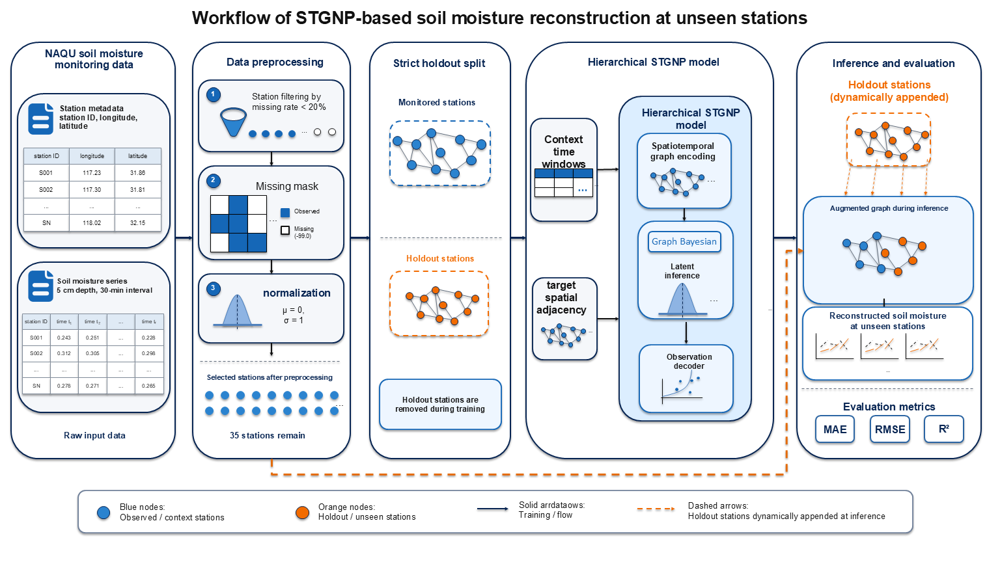
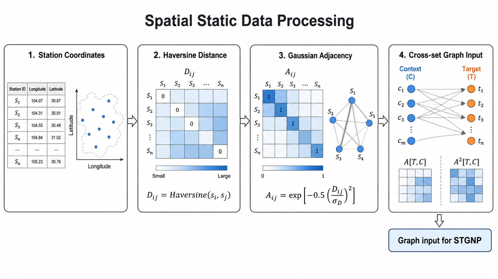
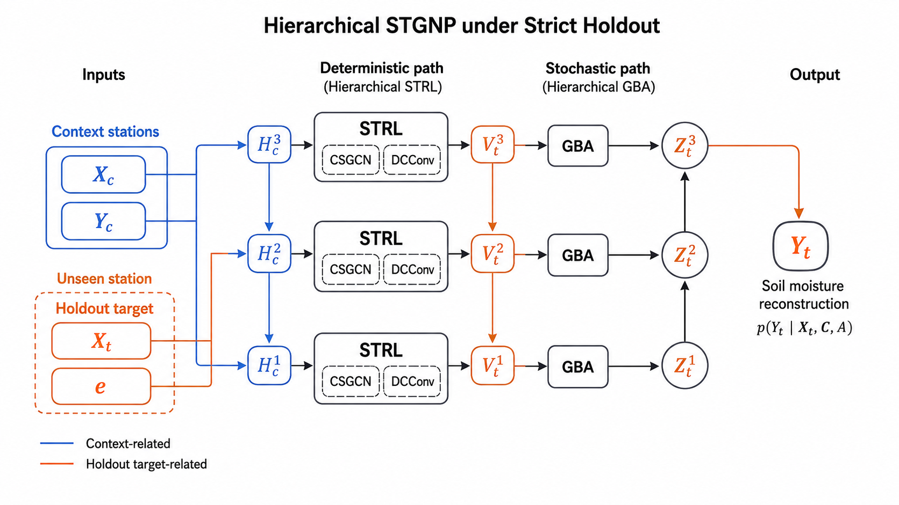

# 论文初稿：方法部分

## 2. 方法

### 2.1 问题定义与总体框架

#### 2.1.1 严格站点级 holdout 任务定义

本文研究稀疏土壤水分监测网络中的未见站点重建问题。给定一组已经部署传感器并具有连续土壤水分观测的站点，目标是在训练阶段完全不使用若干目标站点的土壤水分序列和图节点信息，仅在推理阶段根据这些站点的空间位置重建其土壤水分动态。该设置模拟真实监测网络中“某些位置尚未布设传感器，但需要根据已有站点推断其土壤水分变化”的应用场景。

与普通时间序列预测不同，本文的目标站点不是训练阶段已经出现过的节点；与常见图节点插值或缺测补全不同，holdout 站点在训练阶段既不参与训练样本，也不参与训练图结构。因此，模型不能通过目标站点历史观测或目标节点嵌入记忆其局地动态，而必须从观测站点的时间序列和空间关系中学习可迁移的时空映射。本文将这一设置称为 strict station-level holdout。

#### 2.1.2 Context stations 与 holdout target stations

设筛选后的土壤水分监测网络包含 $N$ 个站点，每个站点 $v_i$ 具有空间坐标 $s_i=(lon_i,lat_i)$ 和土壤水分时间序列 $Y_i$。在一次 strict holdout 实验中，站点集合被划分为观测站点集合 $C$ 和目标站点集合 $T$。$C$ 中的站点作为 context stations，提供历史土壤水分序列和空间上下文；$T$ 中的站点作为 holdout target stations，在训练阶段完全移除，仅在推理阶段根据经纬度动态加入图结构。

在 neural process 形式下，本文需要学习从 context stations 到 holdout target stations 的条件分布：

$$
p(Y_T \mid Y_C, A_{T,C}),
$$

其中 $Y_C$ 表示观测站点在输入时间窗口内的土壤水分序列，$Y_T$ 表示目标站点待重建的土壤水分序列，$A_{T,C}$ 表示从目标站点到观测站点的跨集合空间邻接。当前模型仅使用土壤水分作为动态输入变量，因此输出维度 $d_y=1$，未额外引入降雨、温度或遥感协变量。

需要说明的是，本文区分两类 target：训练阶段在非 holdout 站点内部采样得到的目标节点称为 training target nodes，用于学习 context-target 条件映射；严格留出的未见站点称为 holdout target stations，仅在推理和评价阶段出现。

#### 2.1.3 整体流程概述

本文整体流程如图 1 所示。首先，从 NAQU 土壤水分数据中筛选可用站点，并根据 strict holdout 协议生成训练子集和 holdout 目标站点集合；其次，对站点经纬度和土壤水分序列分别进行空间静态数据处理和时间动态数据处理，构建 context-target 样本；最后，将样本输入 strict-holdout hierarchical STGNP 模型，通过跨集合图卷积、扩张因果卷积和 Graph Bayesian Aggregation 从观测站点推断未见站点的土壤水分分布。

图 1. strict station-level holdout 条件下的土壤水分重建总体流程。训练阶段完全移除 holdout 站点；推理阶段根据目标站点经纬度动态构建 context-to-holdout 空间连接，并输出目标站点土壤水分重建结果。

### 2.2 数据预处理与时空样本构建

#### 2.2.1 站点筛选与缺失值处理

本文使用 NAQU 区域筛选后的 35 个 5 cm 深度土壤水分站点，数据采样间隔为 30 min。站点经纬度信息用于构建空间图，土壤水分序列用于构造时间窗口输入。训练、验证和测试按时间维度划分，分别使用 0-70%、80-90% 和 90-100% 的时间段。

原始数据中 `-99.0` 表示缺失值。为了避免缺失观测影响归一化和评价，本文首先为每个站点和时间步构建缺失掩码：

$$
m_i^t=
\begin{cases}
1, & y_i^t \text{ 为缺失值},\\
0, & y_i^t \text{ 为有效观测值}.
\end{cases}
$$

缺失位置不参与标准化参数估计，也不参与最终误差评价。为了形成连续模型输入，缺失土壤水分值使用对应站点有效观测均值填补；若某站点全部缺失，则使用所有站点有效观测的全局均值作为兜底。随后，本文在对应时间划分内使用非缺失观测计算均值 $\mu$ 和标准差 $\sigma$，并将该划分内的土壤水分序列标准化为

$$
\tilde{y}_i^t=\frac{y_i^t-\mu}{\sigma}.
$$

这种处理方式保留了完整时间窗口输入所需的连续张量结构，同时通过缺失掩码确保模型训练和评价仍然以真实有效观测为准。

#### 2.2.2 空间静态数据处理

空间静态数据描述站点之间的几何关系。与排水管网中可直接由拓扑连接构建邻接矩阵不同，NAQU 土壤水分站点之间不存在明确的管网边或流向边。因此，本文使用站点经纬度构建距离衰减空间图，以表示站点间潜在的空间相关性。

具体而言，首先按照站点编号对站点元数据排序，使经纬度矩阵与土壤水分数据列保持一致。对于任意两个站点 $v_i$ 和 $v_j$，使用 Haversine 公式计算球面距离 $d_{ij}$。随后，通过 Gaussian kernel 将距离转换为邻接权重：

$$
A_{ij}=\exp\left[-\frac{1}{2}\left(\frac{d_{ij}}{\sigma_d}\right)^2\right],
$$

其中 $\sigma_d$ 为所有站点两两距离的标准差。该处理使距离较近的站点具有较大权重，距离较远的站点仍保留连续但较弱的影响。

图 2. 空间静态数据处理流程。站点经纬度被转换为 Haversine 距离矩阵，并进一步映射为 Gaussian 距离衰减邻接矩阵；在 strict holdout 推理阶段，目标站点根据经纬度动态加入并重新计算其与 context stations 的连接。

为了适配 STGNP 的 context-target 条件建模，本文并不直接使用完整邻接矩阵进行全节点传播，而是在每个样本中构建从目标站点到观测站点的跨集合邻接。给定目标集合 $T$ 和观测集合 $C$，一阶和二阶邻接分别为

$$
A^{(1)}_{T,C}=A[T,C],
$$

$$
A^{(2)}_{T,C}=A^2[T,C].
$$

最终输入模型的空间张量为 $[A^{(1)}_{T,C},A^{(2)}_{T,C}]$，形状为 $2\times |T|\times |C|$。一阶邻接表示目标站点与观测站点之间的直接空间关系，二阶邻接补充更宽范围的空间上下文。该设计使空间图服务于“从 context stations 向 holdout target stations 传播信息”这一核心任务。

需要强调的是，邻接矩阵的构建始终遵循 strict holdout 约束。训练阶段的空间图只在非 holdout 训练站点上计算；推理阶段临时加入 holdout stations 时，二阶邻接也仅由站点坐标诱导的空间权重计算得到，不包含 holdout stations 的土壤水分观测信息，因此不会造成观测泄露。

#### 2.2.3 时间动态数据处理

时间动态数据描述各站点土壤水分随时间变化的过程。对站点 $v_i$，其归一化后的土壤水分序列表示为

$$
Y_i=\{\tilde{y}_i^1,\tilde{y}_i^2,\ldots,\tilde{y}_i^T\},
$$

所有站点共同构成张量

$$
Y\in\mathbb{R}^{N\times T\times 1}.
$$

其中第一维为站点，第二维为时间，第三维为土壤水分变量。当前研究只使用土壤水分单变量，因此通道数为 1；如果后续引入降雨、温度、植被指数或土壤属性等环境因子，可在动态或静态特征维继续扩展。

为了生成模型输入样本，本文采用固定长度时间窗口切分土壤水分序列。设输入窗口长度为 $L$，则站点 $v_i$ 在样本起点 $t$ 的时间动态输入为

$$
Y_{i,t:t+L-1}=\{\tilde{y}_i^t,\tilde{y}_i^{t+1},\ldots,\tilde{y}_i^{t+L-1}\}.
$$

由于采样间隔为 30 min，$h$ 小时窗口对应 $L=2h$ 个时间步。本文采用长度为 $L$ 的历史窗口构建模型输入；例如 $L=6$ 对应 3 h 历史观测。不同窗口长度对模型性能的影响将在实验部分讨论。时间窗口构建后，context stations 的窗口序列作为模型输入；非 holdout 训练站点内部采样得到的 training target nodes 在训练阶段提供监督，holdout target stations 的窗口序列在推理阶段仅用于评价。

#### 2.2.4 Strict holdout 下的 context-target 样本组织

Strict holdout 样本组织的关键是保证 holdout target stations 在训练阶段零参与。给定 holdout 站点列表后，本文从训练用站点集合和土壤水分序列矩阵中删除这些站点，并仅使用剩余观测站点构建训练子集。此时 holdout 站点既不作为训练 context，也不作为训练 target，更不会出现在训练邻接矩阵中。

在训练阶段，模型仅在非 holdout 训练站点集合内部构造 context 与 training target 组合，用于学习“从一组观测站点重建另一组目标站点”的条件映射。每个样本包含 context stations 的土壤水分窗口、training target nodes 的监督窗口、跨集合邻接 $A_{T,C}$、context 与 target 缺失掩码以及对应时间戳。缺失掩码不仅用于训练损失过滤，还用于图聚合时抑制缺失观测对目标站点表示的贡献。

在推理阶段，context stations 固定为训练阶段保留的观测站点，holdout stations 作为目标站点动态加入数据对象。模型输入只包含 context stations 的土壤水分窗口和 context-to-holdout 邻接；holdout stations 的真实土壤水分序列不输入模型，只在预测完成后用于误差统计。由此，训练和推理均遵循 strict station-level holdout 约束。

### 2.3 Strict-holdout Hierarchical STGNP 模型

#### 2.3.1 模型总体架构

本文采用 Hu 等提出的 STGNP 程序作为基础，并使用其中的 hierarchical neural process 实现。STGNP 的核心思想是将 neural process 的 context-target 条件建模与图神经网络的空间传播能力结合：给定 context stations 的观测序列和目标站点位置，模型学习目标站点土壤水分序列的预测分布。图 3 给出了本文使用的 STGNP 内部架构。

图 3. strict-holdout hierarchical STGNP 的模型结构。模型首先通过确定性时空表示学习模块从 context stations 提取空间和时间信息，再通过 Graph Bayesian Aggregation 构建目标站点潜变量，最后由观测解码器输出 holdout target stations 的土壤水分预测分布。

该模型包含三条主要路径。第一条是确定性时空表示学习路径，用于从 context stations 的土壤水分序列和 context-to-target 空间邻接中学习多层表示；其中 Cross-Set Graph Convolution (CSGCN) 负责目标站点从 context stations 接收空间信息，Dilated Causal Convolution (DCConv) 负责编码土壤水分的时间动态。第二条是随机潜变量路径，通过 Graph Bayesian Aggregation (GBA) 在考虑空间距离和不确定性的情况下聚合 context 信息，形成目标站点潜变量。第三条是观测解码路径，将多层潜变量映射为目标站点土壤水分的 Gaussian 输出分布。

在 strict holdout 场景下，该结构的关键优势是目标站点不需要历史土壤水分输入。目标站点不输入其历史土壤水分序列，而是以共享可学习 target token 作为初始查询表示；空间信息通过 CSGCN 从 context stations 传入，时间动态由 context stations 的 DCConv 表示提供，随机潜变量则通过 GBA 汇总不同 context station 的可靠性和空间贡献。因此，模型能够在训练阶段未见目标站点的情况下进行重建。

#### 2.3.2 确定性时空表示学习

确定性路径的第一步是构造 context 和 target 的初始表示。对于 context stations，模型将土壤水分窗口 $Y_C$ 通过 $1\times1$ 卷积嵌入到隐藏空间，得到初始 context 表示 $H_C^0$。对于 holdout target stations，由于其土壤水分序列在推理阶段不可用，模型不使用零填充或插值作为目标输入，而是采用共享的可学习 target token $e$ 作为初始 target 表示：

$$
H_C^0=\phi_e(Y_C),\qquad V_T^0=e.
$$

这种 target token 设计避免了两类问题：零填充可能被模型误解为真实的土壤水分数值，插值又会在 strict holdout 设置下引入目标站点伪观测。可学习 token 不包含目标站点历史值，只提供一个由训练过程学习到的目标状态起点，随后由空间邻接和 context 信息逐层更新。

CSGCN 用于解决 holdout target stations 如何从 context stations 接收空间信息的问题。普通 GCN 往往在完整节点集合上同时传播信息，但本文的任务重点是从观测集合 $C$ 到目标集合 $T$ 的跨集合传播。因而，CSGCN 只建模 target-context 之间的连接，而不强调 context 内部或 target 内部的全图传播。对目标站点 $m\in T$，其第 $l$ 层表示可概括为由上一层目标表示、context station 表示以及一阶/二阶跨集合邻接共同决定：

$$
V_m^l=f_{\mathrm{CSGCN}}\left(
V_m^{l-1},
\{H_n^{l-1}, A_{mn}^{(k)}\}_{n\in C,k\in\{1,2\}}
\right).
$$

其中 $A_{mn}^{(1)}$ 和 $A_{mn}^{(2)}$ 分别来自一阶和二阶 context-to-target 邻接。实际实现中，context station 的缺失掩码会参与邻接归一化；当某个 context station 在对应时间步缺失时，其贡献被置零，从而避免填补值通过空间聚合直接影响目标站点表示。

CSGCN 的作用并不是学习一个固定的全图节点嵌入，而是学习“给定一组 context stations 时，如何把这些站点的信息传递到目标站点”。这与本文的 strict holdout 任务一致：目标站点在训练阶段不存在于训练图中，但推理阶段可以根据经纬度得到与 context stations 的边权。因此，只要能够由站点坐标构建 context-to-target 空间连接，CSGCN 便可将观测站点的空间上下文映射到目标站点表示中。

扩张因果卷积（Dilated Causal Convolution, DCConv）用于解决 context stations 的土壤水分时间动态如何编码的问题。土壤水分具有明显的短期连续性，同时又会受到降水、蒸散和局地环境变化的影响；因此，模型需要在有限历史窗口内提取近期变化趋势。与循环结构不同，DCConv 通过堆叠因果卷积层捕捉时间依赖。第 $l$ 层在时间 $t$ 的表示可概括为

$$
h_{i,t}^{l}=\sum_{s=0}^{K-1}\mathcal{K}_l(s)\odot H_i^{l-1}(t-\eta_l s),
$$

其中 $\mathcal{K}_l$ 为卷积核，$K$ 为核大小，$\eta_l$ 为膨胀率。因果卷积保证当前时间步只使用当前及过去的观测信息；膨胀率随层数增加而扩大，使上层能够覆盖更长的历史范围。

在本文实现中，每层确定性表示学习先执行 CSGCN，再执行 DCConv，并通过残差连接稳定训练。低层表示保留较细粒度的短期变化，上层表示具有更大的时间感受野，能够表达更长范围的动态模式。最终，模型得到多层 context 表示 $H_C^l$ 和 target 表示 $V_T^l$，为后续随机潜变量建模提供不同尺度的时空特征。

#### 2.3.3 Graph Bayesian Aggregation 与随机潜变量建模

随机潜变量用于描述未见站点重建中的不确定性。严格 holdout 条件下，目标站点没有历史观测，单一确定性表示难以完整表达“哪些 context stations 更可靠、哪些空间连接更可信、哪些时间状态更不确定”。因此，STGNP 在确定性表示之上引入分层潜变量，将目标站点土壤水分重建建模为条件随机过程。

对第 $l$ 层目标站点 $m$，模型构建潜变量

$$
z_m^l\sim \mathcal{N}(\mu_m^l,(\sigma_m^l)^2).
$$

训练阶段包含条件先验和近似后验两个分支。条件先验 $p(z_T\mid Y_C,A)$ 只使用 context stations 和 target token 表示，模拟推理阶段可获得的信息；近似后验 $q(z_T\mid Y_C,Y_T,A)$ 在训练时额外使用 training target nodes 的真实监督值，以提供更充分的潜变量学习信号。推理阶段没有 $Y_T$ 输入，因此只使用由 context stations 诱导的条件先验生成预测。

GBA 用于在考虑空间距离和不确定性的情况下形成目标站点潜变量。模型首先从目标表示中估计目标潜变量先验参数 $\mu_{t,m}$ 和 $\sigma_{t,m}^{2}$，同时从 context 表示中估计 latent observation $r_{c,n}$ 及其方差 $\sigma_{c,n}^{2}$。随后，根据归一化后的 context-to-target 邻接权重 $\tilde{A}_{mn}$ 对这些 latent observations 进行 Gaussian conditioning。其核心聚合形式可写为

$$
\bar{\sigma}_{m}^{2}=\left[\frac{1}{\sigma_{t,m}^{2}}+
\sum_{n\in C}\frac{\tilde{A}_{mn}^{2}}{\sigma_{c,n}^{2}}\right]^{-1},
$$

$$
\bar{\mu}_{m}=\bar{\sigma}_{m}^{2}\left[
\frac{\mu_{t,m}}{\sigma_{t,m}^{2}}+
\sum_{n\in C}\frac{\tilde{A}_{mn}^{2}r_{c,n}}{\sigma_{c,n}^{2}}
\right].
$$

上述形式使 context station 的贡献同时受空间距离和表示不确定性控制。若某个站点距离目标站点较远，则 $\tilde{A}_{mn}$ 较小，其贡献被削弱；若某个站点的 latent observation 方差较大，说明该站点信息更不确定，其贡献也会降低。这样，GBA 不只是做距离加权平均，而是把图结构和不确定性一并纳入目标潜变量估计。

对 strict holdout 任务而言，GBA 的意义在于为未见站点建立一个可迁移的随机表示。目标站点虽然没有历史土壤水分输入，但其位置决定了与 context stations 的空间权重；context stations 的时间表示提供候选信息源；GBA 进一步根据不确定性调节这些信息源的贡献。由此，模型能够在目标站点完全未参与训练的情况下，为其生成带有不确定性刻画的潜变量表示。

#### 2.3.4 观测解码与优化目标

完成多层 GBA 后，模型将各层目标潜变量在通道维拼接，并输入观测解码器。观测解码器由多层 $1\times1$ 卷积构成，输出目标站点土壤水分的 Gaussian 分布参数：

$$
p(Y_T\mid z_T)=\mathcal{N}(\mu_T,\sigma_T^2).
$$

其中 $\mu_T$ 为预测均值，$\sigma_T$ 为预测标准差。本文在结果分析中使用 $\mu_T$ 作为土壤水分重建值；$\sigma_T$ 保留了模型对目标站点重建不确定性的估计。

训练目标由目标站点有效观测上的负对数似然和分层潜变量后验-先验之间的 KL 散度组成：

$$
\mathcal{L}= -\log p(Y_T\mid z_T)+\beta\sum_l D_{KL}\left(q_l(z_T\mid Y_C,Y_T,A)\Vert p_l(z_T\mid Y_C,A)\right).
$$

其中 $\beta$ 为 KL 权重。损失计算时使用 target missing mask 过滤缺失记录，避免填补值参与似然项。具体网络宽度、潜变量维度和正则化设置等实现细节在实验设置中统一说明。

推理时，模型不再使用近似后验分支，而是根据 context stations 和 context-to-holdout 邻接得到条件先验潜变量，并由观测解码器输出 holdout target stations 的土壤水分分布。最终重建结果取预测均值，预测方差可作为不确定性分析的扩展输出。

### 2.4 未见站点推理

#### 2.4.1 Holdout stations 的动态加入

未见站点推理从训练阶段保留的 context stations 和独立的 holdout stations 信息共同构建。训练子集只包含 context stations，因此模型训练阶段无法接触 holdout stations。测试阶段只向模型提供 holdout stations 的经纬度，用于构建空间连接；对应测试时间段的真实土壤水分序列仅用于最终评价，不作为模型输入。

动态加入后，holdout stations 与 context stations 共同组成推理阶段的临时图。这样做的目的是允许模型使用目标站点位置构建空间关系，同时仍保持训练阶段的严格零参与约束。换言之，推理阶段仅使用目标站点的空间位置信息，而不使用其历史土壤水分观测。

#### 2.4.2 Context-to-holdout adjacency 构建

holdout stations 加入后，数据集重新计算 Haversine-Gaussian 邻接矩阵，并从中截取 context-to-holdout 跨集合连接。设 $C$ 为训练阶段保留的观测站点，$T_h$ 为动态加入的 holdout stations，则推理阶段输入模型的邻接为

$$
A^{(1)}_{T_h,C}=A[T_h,C],\qquad A^{(2)}_{T_h,C}=A^2[T_h,C].
$$

该邻接张量决定了 CSGCN 和 GBA 中 context stations 对 holdout target stations 的空间贡献。推理阶段的二阶邻接仅由站点坐标诱导的空间权重计算得到，不包含 holdout stations 的土壤水分观测信息，因此不会破坏 strict holdout 约束。若某个 context station 与 holdout station 更接近，其边权通常更大；若其观测在某些时间步缺失，则缺失掩码会在聚合过程中抑制其贡献。由此，推理阶段的空间传播同时考虑站点位置和观测有效性。

#### 2.4.3 土壤水分重建输出

在每个测试时间窗口内，模型输入 context stations 的归一化土壤水分序列、缺失掩码和 context-to-holdout 邻接，输出 holdout stations 的归一化预测分布。预测均值经相应标准化参数反归一化，得到原始土壤水分尺度下的重建值。

最终，本文仅在 holdout stations 的非缺失观测上评估重建误差。模型输出可以按总体时间-站点样本聚合，也可以按站点分别统计 MAE、RMSE、$R^2$ 等指标，用于分析不同未见站点的重建难度和空间误差分布。由于 holdout stations 在训练阶段完全移除，这一评价结果反映的是模型对未见站点的空间外推能力。
