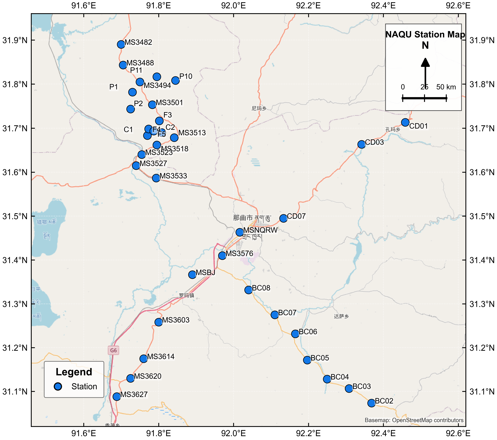
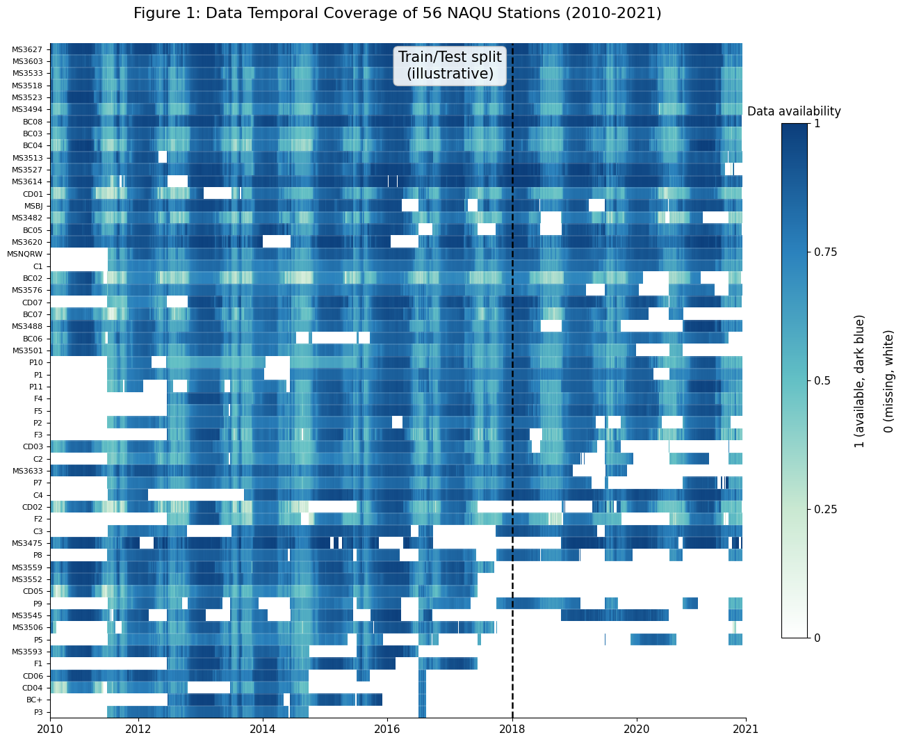

## 3. 案例研究与实验设置

### 3.1 研究区与数据来源

本文以青藏高原中部那曲（NAQU）土壤水分监测网络为案例研究对象。该区域位于西藏自治区那曲地区，是青藏高原土壤水分遥感验证和陆面过程研究中常用的地面观测区之一。研究区海拔高，地表以高寒草地为主，站点建设、供电通信和长期维护成本较高，因而具有稀疏土壤水分监测网络的典型特征。本文使用站点的经度范围为 91.69-92.46°E，纬度范围为 31.07-31.89°N，海拔范围为 4470-4953 m。

图 4. NAQU selected35 土壤水分站点空间分布。蓝色圆点表示本文保留的 35 个土壤水分站点，底图用于展示站点在那曲区域内的空间位置关系。

原始数据来自国家青藏高原科学数据中心发布的青藏高原中部土壤温湿度观测数据（https://data.tpdc.ac.cn/zh-hans/data/805a6b93-201c-48ea-a131-27dd639d477a）。数据包含站点位置表和土壤水分时间序列表两部分。站点位置表记录站点编号、经度、纬度和海拔；时间序列表按统一时间戳记录各站点的土壤水分观测值。本文选取 5 cm 深度土壤水分作为研究变量，时间分辨率为 30 min，原始缺失值以 `-99.0` 标记。

原始 NAQU 数据包含 56 个候选站点。本文首先统计每个候选站点在研究时段内 5 cm 土壤水分序列的缺失率，并检查站点是否同时存在于位置表和时间序列表中。随后按缺失率从低到高筛选，并综合考虑站点空间匹配情况，保留观测完整性较好的 35 个站点；入选站点的最高缺失率约为 20.21%。该数据集记为 NAQU selected35。筛选后的数据时间范围为 2010-08-01 00:00 至 2021-10-01 00:00，共 195793 个 30 min 时间步；整体缺失率约为 8.73%，有效土壤水分观测值范围为 0.000-0.793。

表 1. NAQU selected35 土壤水分数据集统计信息。

| 项目 | 内容 |
|---|---|
| 数据来源 | 国家青藏高原科学数据中心 |
| 研究区域 | 青藏高原中部那曲（NAQU）地区 |
| 候选站点数量 | 56 |
| 主实验站点数量 | 35 |
| 观测变量 | 5 cm 土壤水分 |
| 时间分辨率 | 30 min |
| 时间范围 | 2010-08-01 00:00 至 2021-10-01 00:00 |
| 时间步数 | 195793 |
| 经纬度范围 | 91.69-92.46°E, 31.07-31.89°N |
| 海拔范围 | 4470-4953 m |
| 缺失标记 | `-99.0` |
| 整体缺失率 | 约 8.73% |
| 有效土壤水分范围 | 0.000-0.793 |

### 3.2 数据集构建与时间划分

NAQU selected35 由原始站点位置表和 5 cm 土壤水分时间序列表共同构建。首先根据缺失率筛选候选站点，剔除长期缺失比例较高的站点；其次检查保留站点是否同时存在于站点位置表和土壤水分时间序列表中；最后按照站点编号排序，使站点坐标、土壤水分序列和后续实验中的节点顺序保持一致。如图 5 所示，56 个候选站点的时间覆盖差异明显，其中排序靠前的站点具有更连续的有效观测和更少的大段缺测。本文保留其中观测完整性较好的前 35 个站点，作为后续 strict holdout 重建实验的数据基础。最终保留的 35 个站点为 BC02、BC03、BC04、BC05、BC06、BC07、BC08、C1、C2、CD01、CD03、CD07、F3、F4、F5、MS3482、MS3488、MS3494、MS3501、MS3513、MS3518、MS3523、MS3527、MS3533、MS3576、MS3603、MS3614、MS3620、MS3627、MSBJ、MSNQRW、P1、P10、P11 和 P2。

缺失值以 `-99.0` 标记。本文为缺失位置建立二值缺失掩码，并在形成连续模型输入时使用对应站点有效观测均值进行填补；若某站点在当前划分内没有有效观测，则使用全体有效观测的全局均值作为兜底。缺失掩码用于训练和评价阶段过滤无效观测，避免填补值被作为真实观测解释。

图 5 展示了 56 个候选站点在 2010-2021 年期间的时间覆盖情况。不同站点存在明显的时间覆盖差异，排序靠前的站点整体具有较完整的长期记录，而排序靠后的站点存在更明显的阶段性缺测、起始时间差异或后期大段缺失。选择前 35 个观测完整性较好的站点，可以在保留 NAQU 网络空间覆盖的同时，提高训练和评价阶段有效观测的稳定性。

图 5. NAQU 56 个候选站点的时序覆盖热力图。深蓝色表示有效观测，浅色或白色表示缺失观测；纵轴站点按观测完整性排序。本文选取排序靠前的 35 个站点构建 NAQU selected35 数据集，虚线用于示意训练与后续评价时间段的分界。

时间维度按照固定比例划分为训练、验证和测试阶段。训练集使用全时间序列的 0-70%，验证集使用 80-90%，测试集使用 90-100%；中间 70-80% 的时间段不参与训练、验证或测试，作为相邻阶段之间的时间间隔，以降低时间序列连续性带来的直接过渡影响。按照当前 195793 个时间步计算，各阶段对应的时间范围见表 2。

表 2. 时间划分设置。

| 阶段 | 比例范围 | 时间步数 | 时间范围 |
|---|---:|---:|---|
| 训练 | 0-70% | 137055 | 2010-08-01 00:00 至 2018-05-26 07:00 |
| 间隔段 | 70-80% | 19579 | 2018-05-26 07:30 至 2019-07-08 04:30 |
| 验证 | 80-90% | 19579 | 2019-07-08 05:00 至 2020-08-19 02:00 |
| 测试 | 90-100% | 19580 | 2020-08-19 02:30 至 2021-10-01 00:00 |

模型样本由滑动时间窗口构建。对于每一个时间索引，模型取连续 $L$ 个 30 min 时间步作为输入窗口，并重建目标站点在该窗口内的土壤水分序列，而不是只预测单一末端时刻。由于原始数据采样间隔为 30 min，$h$ 小时历史窗口对应 $L=2h$ 个时间步。缺失掩码用于标识窗口内的有效观测位置，损失计算和评价指标统计仅保留真实有效观测。训练策略与传感器配置实验统一采用 4 h 历史窗口，即 $L=8$；时间窗口消融实验设置 1、2、3、4、5、6、8 和 12 h，用于评估输入历史长度对模型表现的影响。

### 3.3 实验配置与参数设置

本案例研究将 NAQU selected35 监测网络表示为由 35 个站点构成的空间图，节点属性数据为 5 cm 土壤水分序列，可表示为 $\mathbf{Y}\in\mathbb{R}^{35\times195793\times1}$。实验采用第二章定义的 strict station-level holdout 协议。holdout 站点在训练阶段完全不可见，不参与训练样本构建、损失计算和模型参数更新；训练阶段仅使用观测站点数据，测试阶段再对未参与训练的 holdout 站点进行重建评价。

本文主模型为 hierarchical STGNP，使用 `SM_config1` 配置。空间关系由站点经纬度构建，具体建模过程见第二章方法部分。训练过程使用 Adam 优化器，初始学习率为 0.001，batch size 为 128，KL 项权重为 1.0。模型训练 30 个 epoch，验证阶段以 RMSE 选择最佳 checkpoint。评价指标包括 MAE、RMSE 和 $R^2$：MAE 用于衡量平均绝对重建误差，RMSE 对较大误差更敏感，$R^2$ 用于衡量模型对目标站点土壤水分变化的解释能力。

表 3. Hierarchical STGNP 的主要模型与训练参数。

| 参数 | 设置 |
|---|---|
| 模型 | hierarchical STGNP |
| 配置名称 | `SM_config1` |
| 输入变量数 | 1（土壤水分） |
| TCN 通道数 | `[32, 64]` |
| 潜变量通道数 | `[16, 32]` |
| 嵌入维度 | 16 |
| 潜变量层数 | 1 |
| 观测网络隐藏维度 | 128 |
| 观测网络层数 | 3 |
| 时间卷积核大小 | 3 |
| Dropout | 0.1 |
| 优化器 | Adam |
| 初始学习率 | 0.001 |
| KL 权重 | 1.0 |
| Batch size | 128 |
| 训练轮数 | 30 |
| 学习率衰减轮数 | 0 |
| 训练策略与比例实验窗口 | 4 h（$L=8$） |
| 时间窗口消融范围 | 1、2、3、4、5、6、8、12 h |
| 验证选择指标 | RMSE |
| 评价指标 | MAE、RMSE、$R^2$ |

所有实验均在同一计算环境下完成。硬件环境为 NVIDIA vGPU-32GB 显卡、Intel Xeon Gold 6459C CPU 和 1.0 TiB 系统内存；软件环境使用 PyTorch 2.0.0 和 CUDA 11.8。实验环境配置见表 4。

表 4. 实验运行环境。

| 项目 | 配置 |
|---|---|
| GPU | NVIDIA vGPU-32GB |
| 显存 | 32760 MiB |
| CPU | Intel Xeon Gold 6459C |
| CPU 线程数 | 128 |
| 系统内存 | 1.0 TiB |
| PyTorch | 2.0.0+cu118 |
| CUDA | 11.8 |
